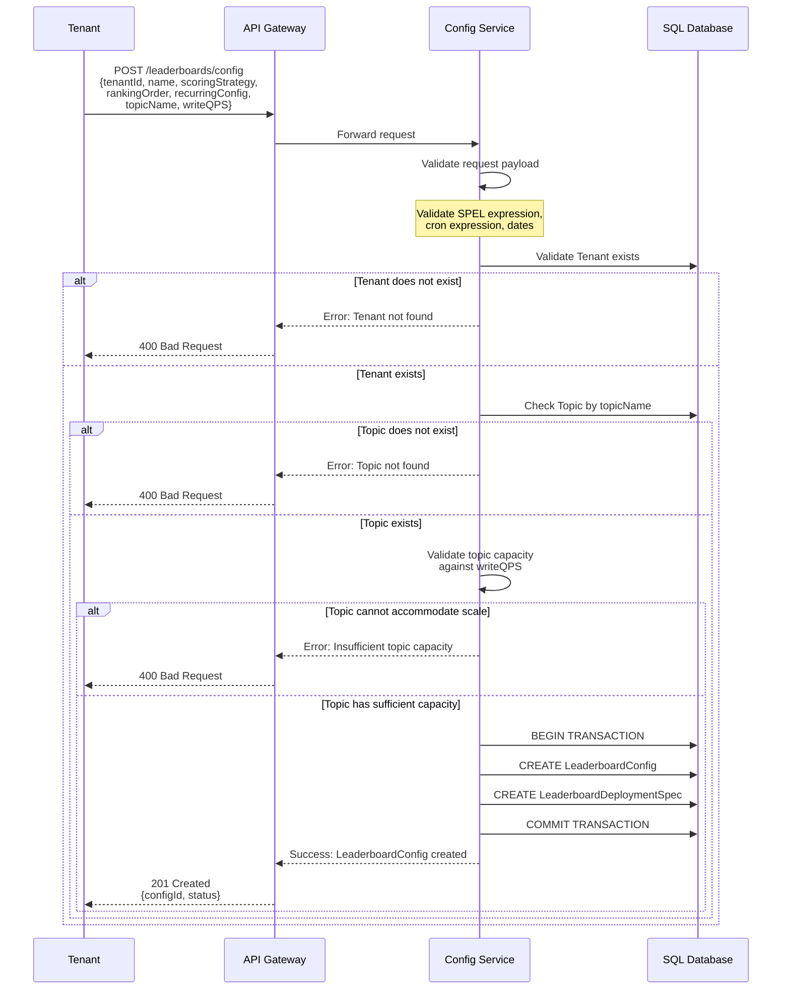
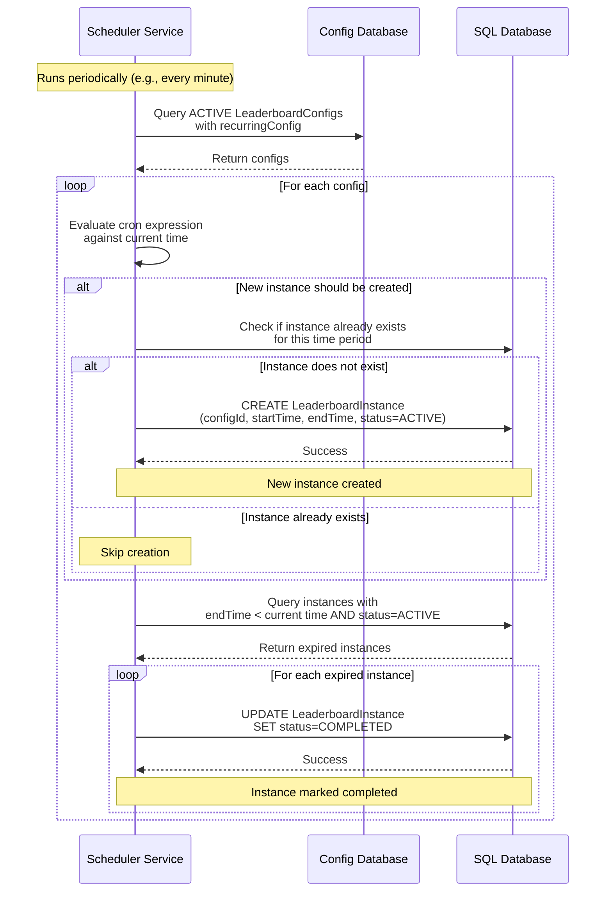
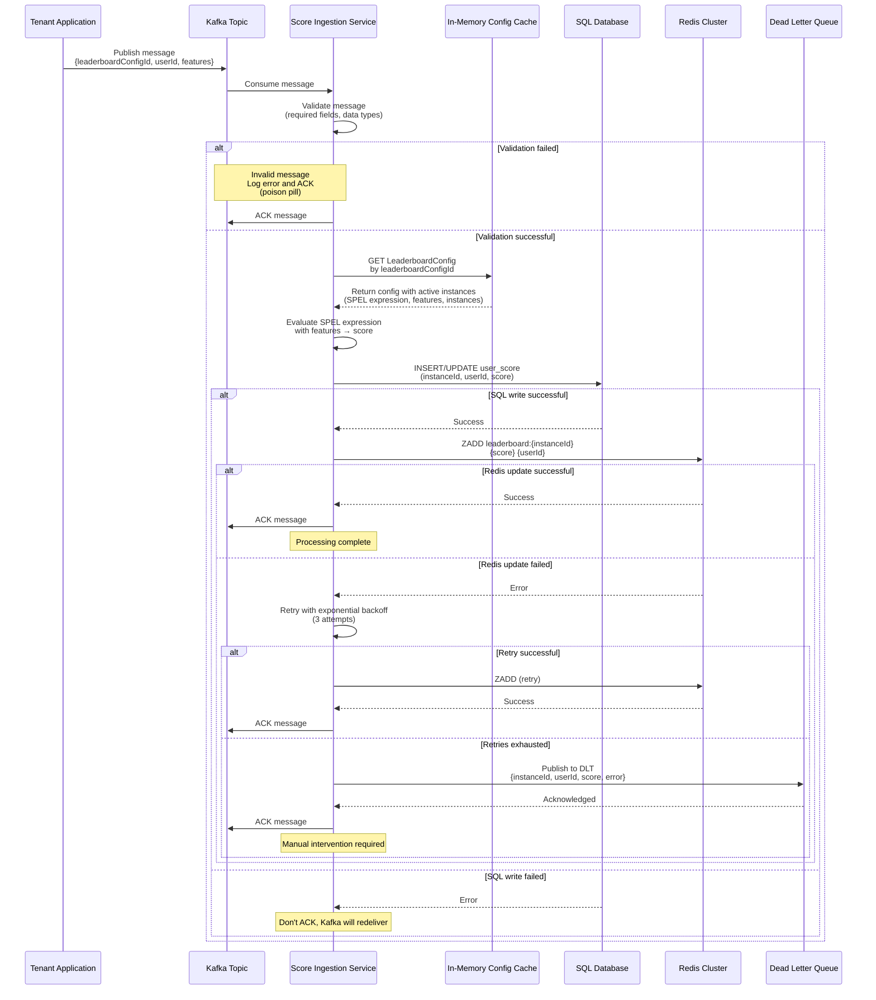
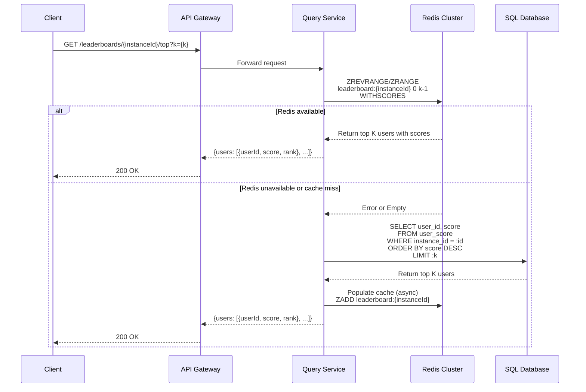
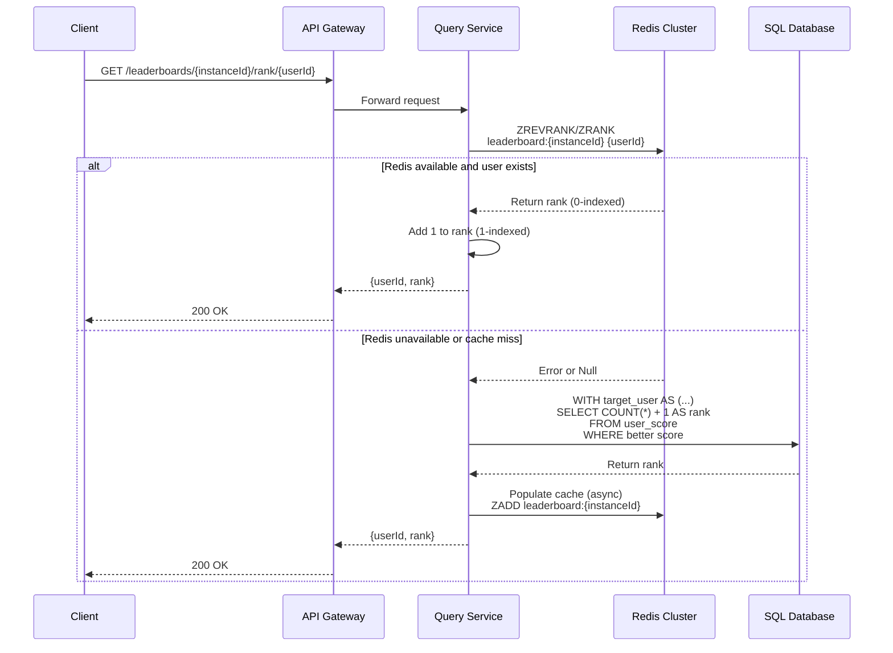

# Leaderboard Platform - Technical Specification

## 1. Overview

This document outlines the technical specifications for a multi-tenant leaderboard platform. The platform enables tenants to configure and manage their own leaderboards with real-time score updates and query capabilities.

---

## 2. Functional Requirements

### 2.1 Multi-Tenancy
- **FR-1.1**: The platform SHALL support multiple isolated tenants.
- **FR-1.2**: Each tenant SHALL be able to configure and manage multiple independent leaderboards.

### 2.2 Leaderboard Configuration
- **FR-2.1**: Tenants SHALL be able to define custom user attributes (features) for their leaderboards.
- **FR-2.2**: Tenants SHALL be able to configure scoring rules on tenant-defined features that compute numeric scores.
- **FR-2.3**: Tenants SHALL be able to specify the sort order for rankings (highest score or lowest score as top).
- **FR-2.4**: Tenants SHALL be able to configure recurring leaderboard schedules with:
  - Recurrence frequency (e.g., daily, weekly, monthly)
  - Start date/time
  - End date/time
- **FR-2.5**: Configuration example: A monthly leaderboard running from the 1st to the 7th of each month.

### 2.3 Score Management
- **FR-3.1**: User scores can be updated multiple times within a leaderboard cycle.
- **FR-3.2**: Score updates SHALL be processed and reflected in rankings in near real-time.

### 2.4 Query Operations

#### 2.4.1 Top K Query
- **FR-4.1**: The platform SHALL support querying the top K users by score for any leaderboard.
- **FR-4.2**: The value of K SHALL be specified by the caller at query time.
- **FR-4.3**: Results SHALL be ordered according to the configured sort order (highest or lowest).

#### 2.4.2 Rank Query
- **FR-4.4**: The platform SHALL support querying the rank of a specific user within a leaderboard.
- **FR-4.5**: The query SHALL accept userId as input and return the user's current rank.
- **FR-4.6**: Users with identical scores SHALL receive the same rank.

---

## 3. Non-Functional Requirements

### 3.1 Performance
- **NFR-1.1**: The platform SHALL support 1,000,000 (1 million) read queries per second across all tenants.
- **NFR-1.2**: The platform SHALL support 100,000 write operations (score updates) per second across all tenants.
- **NFR-1.3**: Query latency SHALL be optimized for near real-time response (xx ms).
- **NFR-1.4**: The platform SHALL support tens to hundreds of tenants.

### 3.2 Consistency
- **NFR-2.1**: The platform SHALL provide near real-time consistency for score updates and ranking queries (score ingestion within xx ms).

### 3.3 Availability
- **NFR-3.1**: The platform SHALL be designed for high availability.
- **NFR-3.2**: Score update operations SHALL not block query operations.

---

## 4. Technical Solution

### 4.1 Tenant Onboarding

This section describes the tenant onboarding process where tenants configure their leaderboards.

#### 4.1.1 Entities

**Tenant**

Represents an organization or entity using the platform.

| Attribute | Type | Description | Constraints |
|-----------|------|-------------|-------------|
| tenantId | String/UUID | Globally unique identifier for the tenant | Primary Key, Not Null |
| name | String | Display name of the tenant | Not Null |

**LeaderboardConfig**

Defines the configuration for a leaderboard that can spawn multiple instances.

| Attribute | Type | Description | Constraints |
|-----------|------|-------------|-------------|
| id | String/UUID | Globally unique identifier for the leaderboard configuration | Primary Key, Not Null |
| tenantId | String/UUID | Reference to the owning tenant | Foreign Key, Not Null |
| version | Integer | Version number of the configuration | Not Null, Default: 1 |
| name | String | Display name of the leaderboard | Not Null |
| featureConfig | Object | Configuration for expected features | Not Null |
| rankingOrder | Enum | Sort order for rankings: `HIGHEST_FIRST` or `LOWEST_FIRST` | Not Null |
| scoringStrategy | Object | Contains scoring configuration | Not Null |
| recurringConfig | Object | Configuration for recurring leaderboard instances (embedded) | Nullable |
| status | Enum | Current status: `DRAFT`, `ACTIVE`, `PAUSED`, `COMPLETED` | Not Null |
| createdAt | Timestamp | Timestamp when the configuration was created | Not Null |
| updatedAt | Timestamp | Timestamp when the configuration was last updated | Not Null |
| startTime | Timestamp | Start time for the first leaderboard instance | Not Null |
| endTime | Timestamp | End time for the last leaderboard instance | Nullable |

*FeatureConfig Object Structure:*
```json
{
  "features": [
    {
      "name": "string",
      "dataType": "STRING|INTEGER|FLOAT|BOOLEAN",
      "required": boolean
    }
  ]
}
```

*ScoringStrategy Object Structure:*
```json
{
  "spelExpression": "string",
  "features": ["feature1", "feature2", ...]
}
```

*RecurringConfig Object Structure:*
```json
{
  "cronExpression": "string",
  "recurringEndTime": "timestamp|null"
}
```

**Topic**

Represents a message queue topic used for streaming score updates.

| Attribute | Type | Description | Constraints |
|-----------|------|-------------|-------------|
| topicName | String | Unique name of the topic | Primary Key, Not Null |
| tenantId | String/UUID | Reference to the owning tenant | Foreign Key, Not Null |
| numberOfPartitions | Integer | Number of partitions in the topic | Not Null, > 0 |

**LeaderboardDeploymentSpec**

Defines the runtime and infrastructure specifications for a leaderboard configuration.

| Attribute | Type | Description | Constraints |
|-----------|------|-------------|-------------|
| id | String/UUID | Globally unique identifier for the deployment spec | Primary Key, Not Null |
| leaderboardConfigId | String/UUID | Reference to the leaderboard configuration | Foreign Key, Not Null, Unique |
| topicName | String | Reference to the topic used for score updates | Foreign Key, Not Null |
| writeQPS | Integer | Expected write queries per second (score updates) | Not Null, > 0 |

**LeaderboardInstance**

Represents a single occurrence or cycle of a leaderboard.

| Attribute | Type | Description | Constraints |
|-----------|------|-------------|-------------|
| instanceId | String/UUID | Globally unique identifier for the leaderboard instance | Primary Key, Not Null |
| leaderboardConfigId | String/UUID | Reference to the parent leaderboard configuration | Foreign Key, Not Null |
| startTime | Timestamp | Start time of this leaderboard instance | Not Null |
| endTime | Timestamp | End time of this leaderboard instance | Not Null |
| status | Enum | Current status: `SCHEDULED`, `ACTIVE`, `COMPLETED` | Not Null |

#### 4.1.2 Onboarding Flow



**Flow Description:**

1. **Request Initiation**: Tenant submits a POST request to create a leaderboard configuration with all necessary parameters including scoring strategy, recurring configuration, topic name, and expected write QPS.

2. **Request Validation**: Config Service validates:
   - SPEL expression syntax in scoring strategy
   - Cron expression format in recurring configuration
   - Date/time values
   - Required fields presence

3. **Tenant Validation**: Config Service verifies that the tenant exists in the database. Returns error if tenant is not found (tenant must be onboarded separately before creating leaderboard configurations).

4. **Topic Validation**: Config Service checks:
   - Topic existence by topicName
   - Topic capacity against the requested writeQPS
   - Returns error if topic is not found or cannot accommodate the expected scale

5. **Configuration Persistence**: If all validations pass:
   - LeaderboardConfig is created with status `DRAFT`
   - LeaderboardDeploymentSpec is created with topic reference and writeQPS
   - Both operations are performed in a database transaction for atomicity

6. **Response**: Returns the created configuration ID and status to the tenant.

#### 4.1.3 Instance Management Flow

Leaderboard instances are automatically created and managed by a scheduler service based on the LeaderboardConfig's recurring configuration.



**Flow Description:**

1. **Scheduler Execution**: Scheduler runs periodically (e.g., every minute) to manage leaderboard instances.

2. **Config Retrieval**: Fetches all ACTIVE LeaderboardConfigs that have a recurringConfig defined.

3. **Instance Creation**: For each config:
   - Evaluates cron expression against current time to determine if a new instance should be created
   - Checks if an instance already exists for the time period to avoid duplicates
   - Creates new LeaderboardInstance with status `ACTIVE` if needed
   - Sets startTime and endTime based on cron expression

4. **Instance Completion**: 
   - Queries for instances where endTime has passed and status is still `ACTIVE`
   - Updates these instances to status `COMPLETED`
   - Completed instances become eligible for archival

5. **Recurring End Check**: If recurringEndTime is specified and reached, scheduler stops creating new instances for that config.

---

### 4.2 Score Update Flow

This section describes how score updates are processed and stored in the platform.

#### 4.2.1 Entities

**UserScore**

Stores the score for a user within a specific leaderboard instance.

| Attribute | Type | Description | Constraints |
|-----------|------|-------------|-------------|
| leaderboardInstanceId | String/UUID | Reference to the leaderboard instance | Foreign Key, Not Null, Part of Composite Key |
| userId | String | Identifier of the user | Not Null, Part of Composite Key |
| score | Numeric | Calculated score for the user | Not Null |
| updatedAt | Timestamp | Timestamp of the last score update | Not Null |

**Composite Primary Key:** (leaderboardInstanceId, userId)

#### 4.2.2 Storage Architecture

The leaderboard platform uses a two-layered storage approach to meet high-performance requirements while maintaining data durability.

**Storage Layers**

**Layer 1: Redis Cluster (Hot Path)**
- **Purpose**: Serve high-throughput read queries (1M reads/sec)
- **Data Structure**: Sorted Sets (ZSET)
- **Key Format**: `leaderboard:{instanceId}`
- **Members**: userId (string)
- **Scores**: User score (numeric)
- **Distribution**: Sharded by `leaderboardInstanceId` across Redis cluster nodes

**Layer 2: SQL Database (Persistent Storage)**
- **Purpose**: Durable storage and source of truth
- **Tables**: `user_score` table stores all user scores
- **Indexes**: 
  - Primary Key: (leaderboard_instance_id, user_id)
  - Composite BTREE Index: (leaderboard_instance_id, score)
- **Distribution**: Sharded by `leaderboardInstanceId` across multiple database instances

**Write Path**

Score updates follow a synchronous dual-write pattern with retry logic.

*Process Flow:*

1. **SQL Write (Primary)**
   ```sql
   INSERT INTO user_score (leaderboard_instance_id, user_id, score, updated_at)
   VALUES (:instanceId, :userId, :score, NOW())
   ON DUPLICATE KEY UPDATE 
     score = VALUES(score),
     updated_at = VALUES(updated_at);
   ```

2. **Redis Update (Secondary)**
   ```
   ZADD leaderboard:{instanceId} {score} {userId}
   ```

3. **Retry Mechanism**
   - If Redis update fails: Retry with exponential backoff (e.g., 3 attempts)

4. **Dead Letter Queue**
   - If retries exhausted: Publish message to DLT
   - DLT contains: instanceId, userId, score, error details
   - Manual or automated replay from DLT

5. **Kafka Acknowledgment**
   - ACK message only after:
     - Both SQL and Redis succeed -> Consistent state between both stores
     - Message successfully published to DLT 
        - Either none of the stores updated or only SQL updated 
        - Message can be replayed later to attain consistent state.
   - Since both the queries (redis & sql) are idempotent, it is safe to retry & replay kafka messages. 

*Idempotency Guarantees:*
- SQL: `ON DUPLICATE KEY UPDATE` allows safe reprocessing
- Redis: `ZADD` overwrites existing scores safely
- Kafka redelivery (on consumer crash) is safe due to idempotent operations

*Consistency Model:*
- SQL is the authoritative source of truth
- Redis provides near real-time read performance
- Temporary divergence possible (seconds) if Redis updates fail temporarily
- DLT monitoring ensures issues are surfaced and resolved

**Alternative Approaches Considered**

*Transactional Outbox Pattern*
- **Approach**: Write SQL + outbox in transaction, async processor updates Redis and marks entry as processed in outbox
- **Not chosen because**:
  - Requires outbox cleanup at 100K writes/sec -> High IOPS and unpredictable autovacuum on table
  - Introduces additional latency to scores getting updated in Redis

*Change Data Capture (CDC)*
- **Approach**: Write to SQL only, CDC stream updates Redis
- **Not chosen because**:
  - Requires additional CDC infrastructure (Debezium, Kafka Connect)
  - Operational complexity of managing CDC pipeline
  - Higher latency (CDC lag + processing time)
  - Direct write approach is simpler and more controllable

*Two-Phase Commit (2PC)*
- **Approach**: Use distributed transaction protocol to ensure atomicity across SQL and Redis
- **Not chosen because**:
  - Redis does not support 2PC/XA transactions natively
  - Introduces significant latency overhead (prepare phase + commit phase)
  - Reduces system availability (coordinator becomes single point of failure)
  - Holding locks during coordination phase impacts throughput at 100K writes/sec

#### 4.2.3 Score Update Flow Diagram

**Sample Event Structure:**

The tenant application publishes score update events to Kafka in the following format:

```json
{
  "leaderboardConfigId": "550e8400-e29b-41d4-a716-446655440000",
  "userId": "user_12345",
  "timestamp": "2025-11-22T01:30:00Z",
  "features": {
    "transactionAmount": 5000.50,
    "transactionCount": 12,
    "averageTransactionValue": 416.71,
    "successfulPayments": 11,
    "failedPayments": 1
  }
}
```

**Field Descriptions:**
- `leaderboardConfigId`: Leaderboard configuration identifier
- `userId`: Unique user identifier
- `timestamp`: Event timestamp (ISO 8601 format)
- `features`: Key-value map of user-defined features used in SPEL expression for score calculation

**Flow Diagram:**



**Flow Description:**

1. **Message Production**: Tenant application publishes a message with raw features to the configured Kafka topic.

2. **Message Consumption**: Score Ingestion Service consumes the message from Kafka.

3. **Message Validation**: Validate incoming message for required fields and data types. Invalid messages are logged and ACKed as poison pills to avoid infinite reprocessing.

4. **Config Lookup**: Service fetches LeaderboardConfig by leaderboardConfigId from in-memory cache. The Config Service returns the configuration along with active leaderboard instances, SPEL expression, and feature definitions (cache is refreshed periodically via Config Service).

5. **Score Calculation**: SPEL expression is evaluated with the provided features to compute the numeric score.

6. **SQL Write**: Score is persisted to SQL database using idempotent INSERT/UPDATE operation.

7. **Redis Update**: If SQL succeeds, update Redis sorted set with the new score.

8. **Retry Logic**: If Redis fails, retry with exponential backoff (3 attempts).

9. **DLT Handling**: If all retries fail, publish to Dead Letter Queue for manual intervention.

10. **Acknowledgment**: Kafka message is acknowledged only after both storage systems succeed or DLT is written.

**Key Points:**
- SQL write failure prevents Kafka ACK, ensuring redelivery
- Idempotent operations allow safe reprocessing
- At-least-once processing guarantee maintained

---

### 4.3 Read Flow

This section describes how read queries (Top K and Rank queries) are processed.

**Read Path**

Read queries are primarily served from Redis for low latency. When Redis is unavailable, the system falls back to SQL.

*Primary Path: Redis*

**Top K Queries:**
- Served from Redis sorted set
- Commands:
  - `ZREVRANGE leaderboard:{instanceId} 0 K-1 WITHSCORES` (HIGHEST_FIRST)
  - `ZRANGE leaderboard:{instanceId} 0 K-1 WITHSCORES` (LOWEST_FIRST)
- Sub-millisecond latency

**Rank Queries:**
- Served from Redis
- Commands:
  - `ZREVRANK leaderboard:{instanceId} {userId}` (HIGHEST_FIRST)
  - `ZRANK leaderboard:{instanceId} {userId}` (LOWEST_FIRST)
- Returns 0-indexed rank; add 1 for 1-indexed rank
- Sub-millisecond latency

*Fallback Path: SQL (Redis Down or Cache Miss)*

When Redis is unavailable or leaderboard not found in cache, queries fall back to SQL.

**Top K Query (HIGHEST_FIRST):**
```sql
SELECT user_id, score
FROM user_score
WHERE leaderboard_instance_id = :instanceId
ORDER BY score DESC
LIMIT :k;
```

**Top K Query (LOWEST_FIRST):**
```sql
SELECT user_id, score
FROM user_score
WHERE leaderboard_instance_id = :instanceId
ORDER BY score ASC
LIMIT :k;
```

**Rank Query (HIGHEST_FIRST):**
```sql
WITH target_user AS (
  SELECT score
  FROM user_score
  WHERE leaderboard_instance_id = :instanceId 
    AND user_id = :userId
)
SELECT COUNT(*) + 1 AS rank
FROM user_score, target_user
WHERE leaderboard_instance_id = :instanceId
  AND user_score.score > target_user.score;
```

**Rank Query (LOWEST_FIRST):**
```sql
WITH target_user AS (
  SELECT score
  FROM user_score
  WHERE leaderboard_instance_id = :instanceId 
    AND user_id = :userId
)
SELECT COUNT(*) + 1 AS rank
FROM user_score, target_user
WHERE leaderboard_instance_id = :instanceId
  AND user_score.score < target_user.score;
```

**Notes:**
- SQL queries use the composite index (leaderboard_instance_id, score) for efficient execution
- Tie handling for users with identical scores will be addressed separately
- On successful SQL query, optionally populate Redis to avoid future cache misses

**Redis Recovery**

*Scenarios:*
1. **Redis node failure**: Cluster handles failover automatically
2. **Complete Redis cluster failure**: 
   - Rebuild from SQL on-demand (cache miss path)
   - Or proactive: Background job loads active leaderboards

*Rebuild Strategy:*
```sql
SELECT user_id, score
FROM user_score
WHERE leaderboard_instance_id = :instanceId
ORDER BY score DESC;
-- Bulk load into Redis sorted set
```

#### 4.3.1 Top K Query Flow



**Flow Description:**

1. **Request**: Client requests top K users for a specific leaderboard instance.

2. **Primary Path**: Query Service attempts to fetch from Redis using ZREVRANGE (highest first) or ZRANGE (lowest first).

3. **Success Path**: If Redis returns data, response is sent immediately with sub-millisecond latency.

4. **Fallback Path**: If Redis is unavailable or cache miss:
   - Query SQL database using indexed query
   - Asynchronously populate Redis cache
   - Return results to client

5. **Response**: Return ranked list of users with their scores.

---

#### 4.3.2 Rank Query Flow



**Flow Description:**

1. **Request**: Client requests the rank of a specific user in a leaderboard instance.

2. **Primary Path**: Query Service attempts to fetch from Redis using ZREVRANK (highest first) or ZRANK (lowest first).

3. **Success Path**: If Redis returns data:
   - Convert 0-indexed rank to 1-indexed
   - Return immediately with sub-millisecond latency

4. **Fallback Path**: If Redis is unavailable or cache miss:
   - Query SQL using COUNT query
   - Asynchronously populate Redis cache
   - Return rank to client

5. **Response**: Return user's rank in the leaderboard.

---

### 4.4 Observability and Alerting

#### 4.4.1 Instrumentation

**Business Metrics:**
- Number of active leaderboards per tenant
- Total users participating in each leaderboard
- Score update rate per leaderboard and per tenant
- Query request rate (Top K and Rank queries) per tenant
- Query latency for read operations
- Cache hit ratio for Redis reads

**Operational Metrics:**
- Kafka consumer lag to track ingestion backlog
- Score ingestion end-to-end latency from message consumption to storage
- Message validation failure rate and count
- SPEL expression evaluation time and failure count
- SQL write success and failure rates
- Redis write success, failure, and retry counts
- Dead Letter Queue message count
- SQL fallback rate when Redis is unavailable
- Database connection pool utilization

#### 4.4.2 Alerts

**Critical Alerts:**
- Kafka consumer lag exceeds threshold indicating ingestion service cannot keep up
- High SQL write failure rate indicating database issues
- Redis cluster unavailable causing complete cache failure
- Dead Letter Queue accumulating messages at high rate indicating systemic failures
- Score ingestion service stopped processing messages despite pending lag

**High Priority Alerts:**
- Redis write retry rate is elevated indicating intermittent connectivity issues
- Query latency degraded beyond acceptable thresholds
- Database connection pool exhausted
- Redis cache miss rate elevated beyond normal levels
- SPEL evaluation failures happening frequently
- Message validation failure rate exceeds threshold indicating data quality issues from tenant applications

**Medium Priority Alerts:**
- SQL table size growing rapidly requiring attention to data retention
- Kafka consumer lag trending upward
- Unusual spike in query traffic
- Score ingestion latency higher than expected

---

### 4.5 Data Archival

Completed leaderboard instances with status `COMPLETED` are eligible for archival to cold storage (e.g., S3, GCS) for historical analysis and compliance. After archival, data can be removed from active SQL storage to manage table growth.
